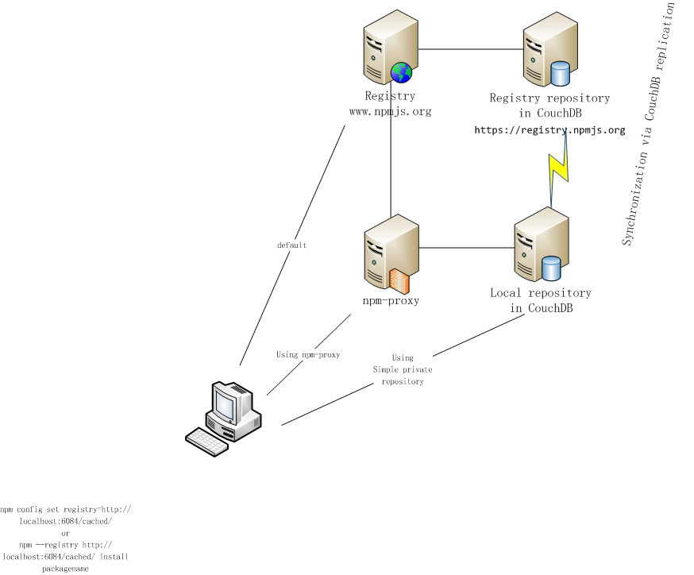
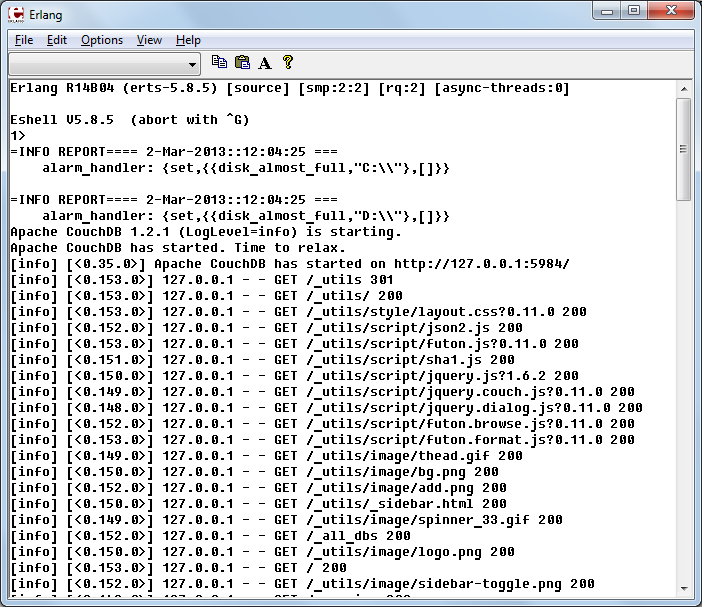
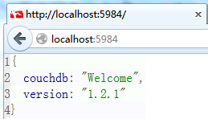

<!--
[npm-proxy](https://github.com/PaulVI/npm-proxy/)
-->

# Node Package Server ( NPS )

Proxy for [Node.js](http://www.nodejs.org/) [NPM](https://npmjs.org/doc/README.html) [registry](https://npmjs.org) repository.

## Dictionary

[**Repository**](http://en.wikipedia.org/wiki/Software_repository) is [CouchDB](http://couchdb.apache.org/)
 database that contains Nodejs modules/packages.  
**Registry** is main repository.  
[**Proxy**](http://en.wikipedia.org/wiki/Proxy_server) is software that acts
 as an intermediary for requests from clients seeking resources from other servers.  
**Clone** is a copy of Registry.   
**Mirror** repository is synchronized with Registry using CouchDB Replication feature.  
[**Cached**](http://en.wikipedia.org/wiki/Cache_%28computing%29) repository is updated from other repository (e.g. Registry) on per request basis.  

## Problem addressed

Registry as of Dec 2014 is 418G in 116k  
(as of Dec 2013 is 175G in 60k projects,  
In May 20th 2013 there 44G of data in 30k projects).
Just navigate to <code>https://registry.npmjs.org/</code>), data grew 10x in 2013, and currently grows 10G per week.

Most development teams don't need 99% of those packages, but quick & reliable access to those being used. 
Current [recommendation to speed up access](https://github.com/isaacs/npm/blob/master/doc/cli/registry.md#can-i-run-my-own-private-registry) 
is clone Registry into new Repository (using continuous replication).  
On slow channels replication can't be finished within one session / one attempt. 
But the most important is that every such attempt makes Registry even slower, as ongoing replication creates additional pressure on Registry server 
and uses the same slow channel.

There is [Commercial alternative, that uses different approach](http://blog.strongloop.com/whats-new-in-strong-loop-node-beta-3-private-repositories/), but again
you depend for Internet connectivity and vulnarable if that curvice is down or degradates.

Most team use the same modules, and once one developer get's module,
other developer should be able to get the same module with near LAN speed.

> NPM components are on track for 4 billion downloads a year.
see at <http://blog.sonatype.com/2014/11/the-billion-club/>

## Status 

This are some materials, code and some ideas.. 
Raise an isse, or contact Paul Verest via skype <code>pverest</code>..
 

## Usage

Give the project a star.

0. Install [CouchDB server](http://couchdb.apache.org/#download).
	There is quick installer for Windows since version 1.2  
	For Linux [Apache CouchDB wiki](http://wiki.apache.org/couchdb/Installing_on_Ubuntu)
	 suggest to use [build-couchdb](https://github.com/iriscouch/build-couchdb)
1. Install NPM-Proxy server (this).
	- [ ] <code>npm install npm-proxy</code> // Help on this needed!
	- (Optionally) configure server URL, port, databases etc. (Defaults are http://localhost:6084/cached/, )
2. Run via <code>node npm-proxy.js</code>		
2. Point npm to use NPM-Proxy server:  
	<code>npm config list</code>  
	<code>npm config set registry=http://localhost:6084/cached/</code>
	(Later you can use <code>npm config del registry</code> to reset to default)  
	or  
	Use the <code>--registry</code> option every time:  
	<code>npm --registry http://localhost:6084/cached/ install packagename</code> 
	
Now your npm requests go through npm-proxy.	

## Developing

0. Please [contact](#status) first. Notes are not full. I present what I know with pleasure.
1. There is '.project.example.xml' file with example how to configure comfy link in Eclise IDE.   
	This way you can start CouchDB from within Eclipse IDE.
2. Start CouchDB.  
	GUI environment (like Windows) is recommended. Run 'couchdb.bat' to launch also Erlang emulator, where you can track requests to CouchDB.  

3. CouchDB Futon UI can be very useful. Open <code>http://localhost:5984/_utils/index.html</code>
4. main file is 'nps.js'. Run it with `node nps.js`.
   Recommended is node-dev: install with `npm install -g node-dev` ; run with `node-dev nps` .
5. [Mozilla Firefox add-on JsonShow](https://addons.mozilla.org/en-US/firefox/addon/jsonshow) is highly recommended to see JSON in human friendly way.
	Press Ctrl+Q after installation at any URL to see it as formated and colorized JSON tree.	

 

## Testing

1. Start CouchDB, npm-proxy (see [above](http://#developing))
2. Open [CouchDB Futon UI](http://localhost:5984/_utils/), see databases content.
3. Select one package that you don't have from [Most Depended-upon Packages list](https://npmjs.org/browse/depended).
 For example <code>optimist</code>
4. Navigate to <code>http://localhost:6084/cached/optimist</code>.
5. NPS start replication. See status at <code>http://localhost:5984/_utils/status.html</code>.
6. When replication finishes, content at <code>http://localhost:6084/cached/optimist</code>
 and <code>http://localhost:6084/cached/optimist</code> nad <code>http://registry.npmjs.org/optimist</code>
 must be the same.
7. See also in Futon <code>http://localhost:5984/_utils/document.html?npm2_cashed/optimist</code>
   
### Ideas

* Use CouachApp to run app (http://couchapp.org/page/index)
 
* use Most Depended-upon Packages list https://npmjs.org/browse/depended  
[CouchDB: Is it possible to control order of replication?](http://stackoverflow.com/questions/15285520/couchdb
-is-it-possible-to-control-order-of-replication)

* [add your idea]
 
